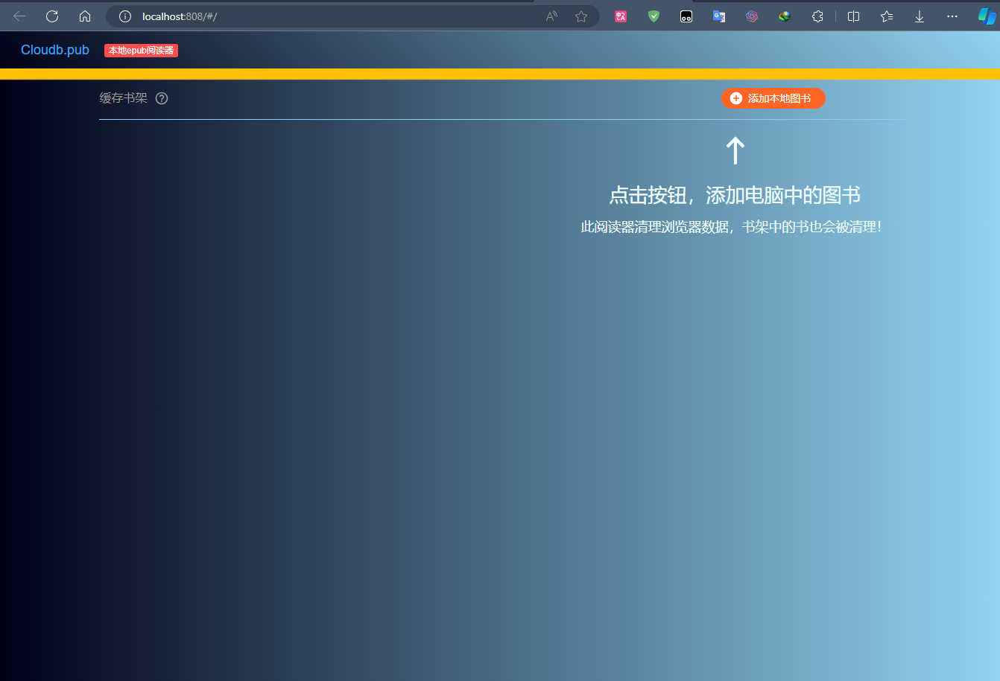
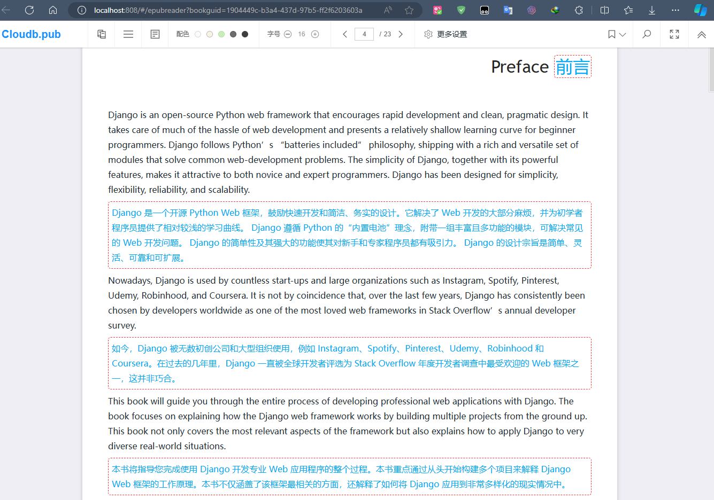
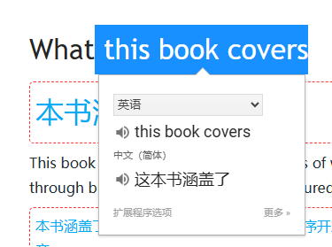

# neat-reader
neat-reader 本地版

也可以直接访问： https://xyz349925756.github.io/neat-reader


官网在线版： https://www.neat-reader.cn/webapp#/

> [!note]
>
> 官网支持云端。 本地端是我为了自己查阅资料方便。



## 使用

1. 支持多种翻译插件，方便查阅资料。



2. 划词翻译




## 配置

本地搭配 nginx 使用。

nginx 配置建议

```conf
	server {
	     listen  808;
		 server_name  localhost;
		 location / {
		     root   E:\\reades;
			 index index.html index.htm;
		 }
		 
		error_page   500 502 503 504  /50x.html;
        location = /50x.html {
            root   html;
        }
	}
```

 root   E:\\reades;   直接把上面的文件放到 reades  目录即可。

